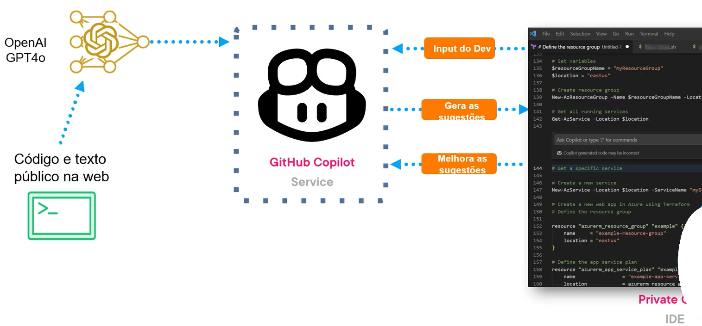
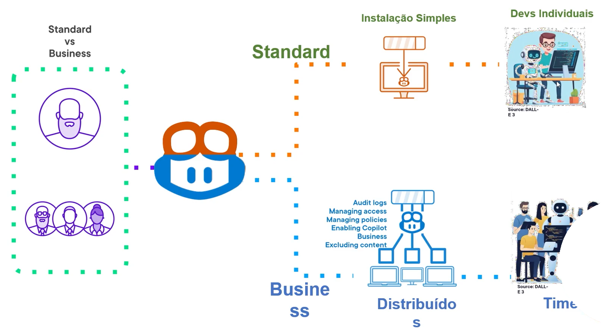
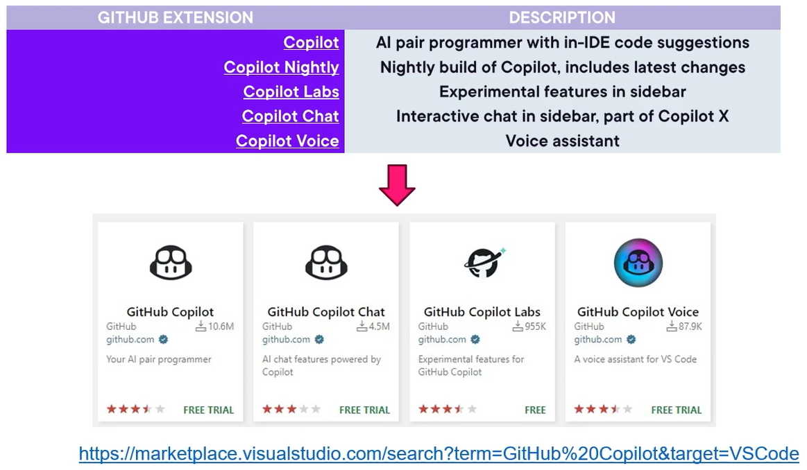
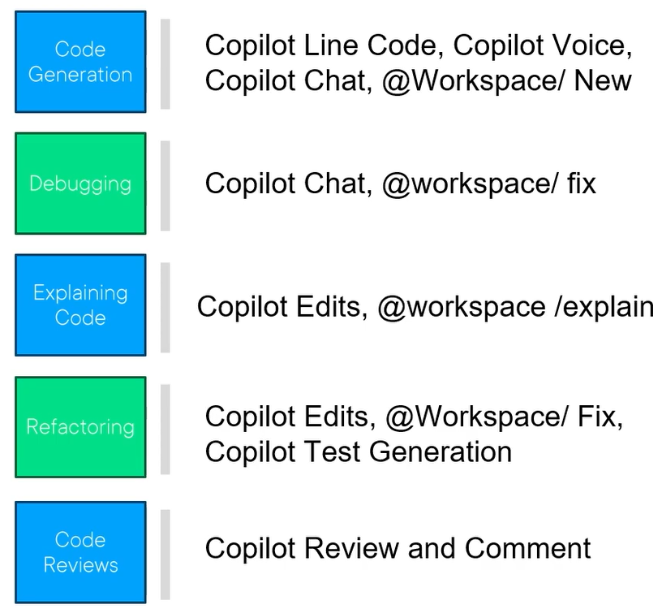

# Inteligência Artificial

É definida como a simulação da inteligência humana em máquinas que são programadas para pensar, aprender e realizar tarefas que normalmente exigem inteligência humana.  
Isso inclui tarefas como resolução de problemas, tomada de decisões, compreensão de linguagem natural e adaptação a novas situações.

---

## Machine Learning

É um subcampo da IA que usa dados e algoritmos para imitar o aprendizado humano.  
Permite que as máquinas realizem tarefas como categorização de imagens ou previsão de flutuações de preços.  
Os algoritmos de ML são tipicamente criados usando frameworks como TensorFlow e PyTorch, treinados para fazer classificações, previsões e descobrir insights importantes.

---

## AI Terminology

- **Deep Learning**  
  Um subconjunto de ML que envolve redes neurais com múltiplas camadas. O deep learning é eficaz para tarefas como reconhecimento de imagens e fala, e processamento de linguagem natural.

- **Neural Networks**  
  Um modelo de aprendizado de máquina inspirado pela estrutura e função do cérebro humano.

- **Natural Language Processing (NLP)**  
  IA que foca na interação entre computadores e humanos por meio de linguagem natural.

- **Computer Vision**  
  IA que permite que as máquinas interpretem e tomem decisões baseadas em dados visuais.

- **Algorithm**  
  Um conjunto de instruções ou regras projetadas para realizar uma tarefa específica ou resolver um problema particular.

- **Artificial Neural Network (ANN)**  
  Um modelo computacional inspirado na estrutura de função de redes neurais biológicas no cérebro humano.

---

## Generative AI

IA Generativa (Gen AI) refere-se a uma categoria de IA que envolve sistemas capazes de gerar conteúdo novo e original.  
A IA Generativa é utilizada em uma ampla gama de indústrias e domínios, como arte, escrita, criação de roteiros, desenvolvimento de software, design de produtos, saúde, finanças, jogos e muito mais.

---

## Pair Programming

Uma prática de desenvolvimento em que dois programadores colaboram em uma única estação de trabalho.  
Um, o **PILOTO**, escreve ativamente o código, enquanto o outro, o **OBSERVADOR** ou **NAVEGADOR**, revisa e fornece feedback em tempo real.

---

## Funcionalidades do GitHub Copilot

Assistente de codificação com inteligência artificial desenvolvido pelo GitHub em colaboração com a OpenAI.

Ele se integra ao Visual Studio Code, sugerindo linhas inteiras ou blocos de código à medida que os desenvolvedores escrevem, aproveitando o modelo de linguagem Codex → GPT4o (Maio/2024) da OpenAI.

Em 2025 (Cloud, Gemini, o1, o3) o GitHub Copilot visa aumentar a produtividade da codificação, fornecendo sugestões de código com reconhecimento de contexto com base no código que está sendo escrito em tempo real.

O Copilot entende TypeScript, Python, Javascript, Ruby e dezenas de outras linguagens comuns.

---

## Funcionamento do GitHub Copilot

---

## Features

- **Autocomplete**  
  O GitHub Copilot oferece sugestões inteligentes de código enquanto você digita, ajudando a escrever código mais rápido e com mais precisão.

- **Sugestões Cientes de Contexto**  
  Ele entende o contexto do seu código e oferece sugestões relevantes com base na tarefa ou função atual.

- **Geração de Código**  
  O GitHub Copilot pode gerar funções inteiras, classes e blocos de código com base em descrições ou comentários em linguagem natural.

- **Suporte a Linguagens**  
  Ele suporta várias linguagens de programação, incluindo Python, Javascript, Go, etc.

- **Documentação e Comentários**  
  O GitHub Copilot também pode gerar comentários e documentação para o seu código.

- **Programação em par**  
  É como ter um programador de IA parceiro que o auxilia em tempo real.

---

## GitHub Copilot Standard vs. Business/Enterprise

---

## IDEs suportadas pelo GitHub Copilot

- Visual Studio Code
- Visual Studio
- Vim
- Neovim
- JetBrains Suite of IDEs
- Azure Data Studio

---

## Extensões

---

## Casos de Uso

---

## Hands-On

**Prompt:**  
@workspace /new Vamos criar uma roleta de jogo de roleta com a velocidade mantendo a rotação e uma bolinha batendo no meio seguindo as leis da física no planeta terra, podemos utilizar html, css, javascript, canva no html para criar as formas e a animação.

